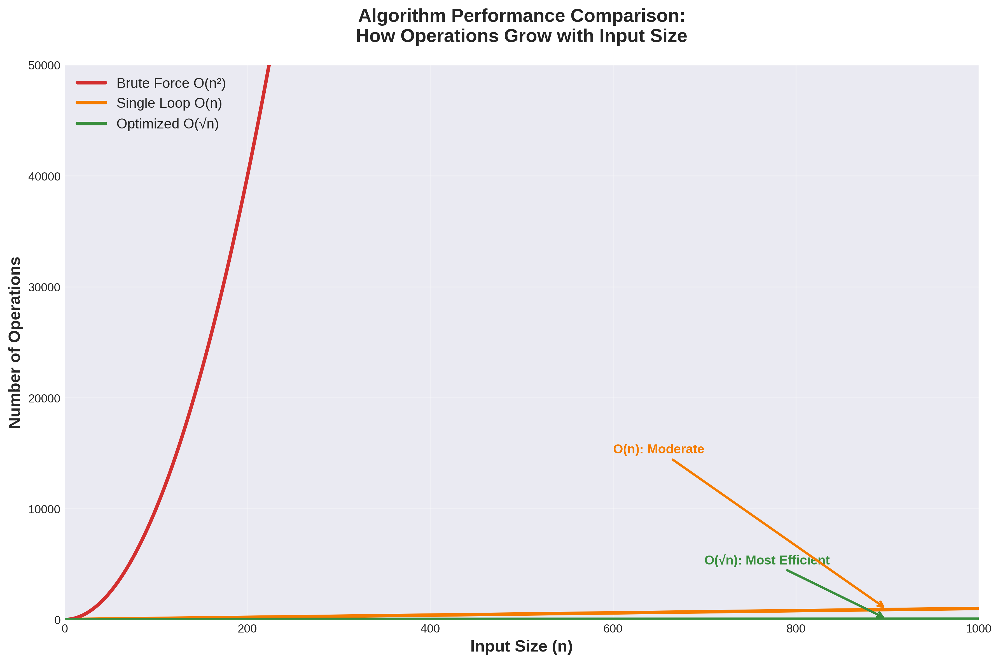

# Factor Pairs Algorithm Visualizer

**From Brute Force to Brilliance: Understanding Algorithmic Optimization**

An interactive educational tool that demonstrates the power of mathematical thinking in algorithm optimization. This project explores three different approaches to finding factor pairs, showing how a simple mathematical insight can improve performance by orders of magnitude.



## 🎯 Overview

This project provides comprehensive educational materials for understanding algorithm optimization through a simple but powerful problem: finding all pairs of numbers that multiply to give a target value `n`.

### Three Approaches Compared:

1. **Brute Force O(n²)** - Check every possible combination
2. **Single Loop O(n)** - Calculate partners directly
3. **Optimized O(√n)** - Use mathematical symmetry around the square root

## 🚀 Live Demo

The interactive website allows you to:
- Adjust the value of `n` with a slider (4-100)
- Select different algorithms to visualize
- Watch step-by-step animations of how each algorithm works
- Compare real-time performance metrics
- View comprehensive graphs and charts

## 📚 What's Included

### 1. Interactive Website
A fully functional React-based web application featuring:
- Real-time algorithm visualization
- Adjustable parameters
- Performance metrics comparison
- Educational content with code examples
- Dark/Light theme support

### 2. Comprehensive Documentation
- **Factor_Pairs_Analysis.pdf** - Beautifully formatted PDF document
- **Factor_Pairs_Analysis.md** - Markdown version with full explanations
- Step-by-step mathematical explanations
- Real-world analogies for non-technical audiences
- Clean technical diagrams and graphs

### 3. Visual Assets
High-quality diagrams including:
- Algorithm comparison flowcharts
- Performance graphs (complexity, operations, speedup)
- Factor pairs symmetry visualizations
- Algorithm flow diagrams

## 🛠️ Technology Stack

- **Frontend**: React 19 + TypeScript
- **Styling**: Tailwind CSS 4
- **UI Components**: shadcn/ui
- **Build Tool**: Vite
- **Routing**: Wouter
- **Visualizations**: Matplotlib (for static graphs), Custom React components

## 📦 Installation

```bash
# Clone the repository
git clone https://github.com/VictorRaz/factor-pairs-algorithm-visualizer.git
cd factor-pairs-algorithm-visualizer

# Install dependencies
cd client
pnpm install

# Start development server
pnpm dev
```

The application will be available at `http://localhost:3000`

## 🎓 Educational Value

This project demonstrates:

### For Students
- How to think mathematically about programming problems
- The importance of time complexity analysis
- Real-world impact of algorithm optimization

### For Educators
- Interactive teaching tool for algorithm complexity
- Visual demonstrations of O(n²), O(n), and O(√n) complexity
- Ready-to-use presentation materials (PDF + interactive demo)

### For Developers
- Practical example of optimization techniques
- Code examples in Python (algorithms) and TypeScript (visualization)
- Best practices for educational web applications

## 📊 Performance Comparison

| Input Size (n) | Brute Force O(n²) | Single Loop O(n) | Optimized O(√n) |
|----------------|-------------------|------------------|-----------------|
| 100            | 10,000 ops        | 100 ops          | 10 ops          |
| 10,000         | 100,000,000 ops   | 10,000 ops       | 100 ops         |
| 1,000,000      | 1,000,000,000,000 ops | 1,000,000 ops | 1,000 ops       |

**The O(√n) solution is up to 1,000,000× faster!**

## 🔑 Key Insight

The breakthrough insight is recognizing that **factors always come in pairs around the square root**:
- For every factor `i ≤ √n`, there's exactly one partner `j ≥ √n` where `i × j = n`
- Checking beyond `√n` only finds duplicate pairs in reverse order
- This reduces the search space from `n` operations to just `√n` operations

## 📁 Project Structure

```
factor-pairs-algorithm-visualizer/
├── client/                      # React web application
│   ├── src/
│   │   ├── pages/              # Main pages
│   │   │   └── Home.tsx        # Interactive visualizer
│   │   ├── components/         # Reusable UI components
│   │   └── App.tsx             # App entry point
│   └── public/                 # Static assets (diagrams, images)
├── docs-diagrams/              # Source files for diagrams
│   ├── *.mmd                   # Mermaid diagram sources
│   ├── *.png                   # Generated diagram images
│   └── generate_graphs.py      # Python script for performance graphs
├── Factor_Pairs_Analysis.md    # Comprehensive documentation (Markdown)
├── Factor_Pairs_Analysis.pdf   # Comprehensive documentation (PDF)
└── README.md                   # This file
```

## 🎨 Features

- **Interactive Slider**: Adjust `n` from 4 to 100 in real-time
- **Algorithm Selection**: Switch between three different approaches
- **Step-by-Step Animation**: Watch algorithms find factor pairs one by one
- **Performance Metrics**: Live comparison of operations and execution time
- **Visual Charts**: Four different graph views (Complexity, Operations, Speedup, Symmetry)
- **Code Examples**: Side-by-side pseudocode for each algorithm
- **Theme Toggle**: Dark and light mode support
- **Responsive Design**: Works on desktop, tablet, and mobile

## 🤝 Contributing

This is an educational project. Contributions are welcome! Feel free to:
- Improve visualizations
- Add more algorithms
- Enhance documentation
- Fix bugs or improve performance
- Add translations

## 📄 License

MIT License - Feel free to use this project for educational purposes.

## 👨‍💻 Author

Created by **Manus AI** as an educational tool for understanding algorithm optimization.

## 🙏 Acknowledgments

- Inspired by classic computer science interview problems
- Built with modern web technologies for maximum accessibility
- Designed to make complex concepts understandable for everyone

---

**Remember**: The O(√n) solution isn't just better code—it's better thinking. This kind of mathematical insight is what separates good developers from great ones.

